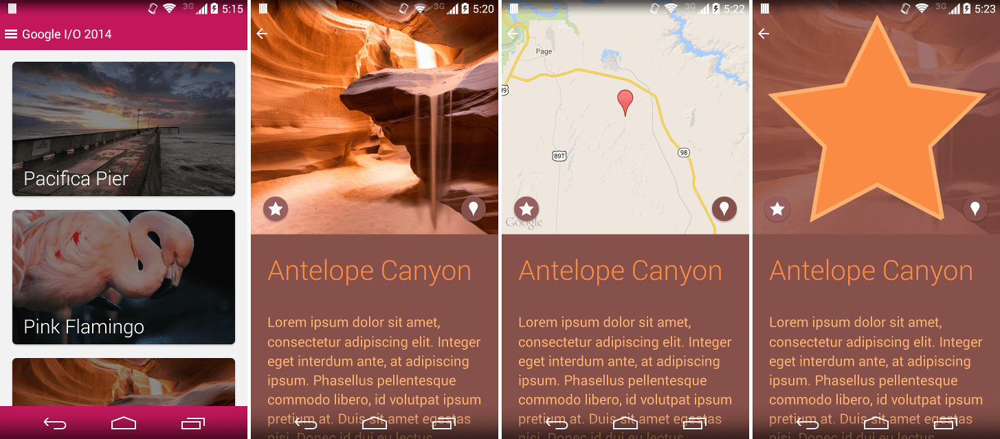
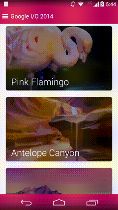
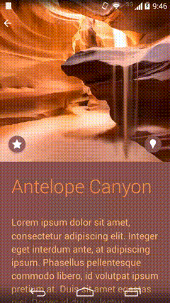

Material Witness Compat
=======================

A Google I/O 2014 demo written by [Romain Guy][1] ported to work on all versions of the platform back to Android 2.3.3 (API Level 10). 

The original Material Witness is a sample application for the new Material Design APIs introduced in the Android L Preview SDK. Most of the features have been backported and include:

* Dynamic palette using the palette support library
* Circular reveal using the blog post by [Romain Guy][1] using [bitmap shaders][4]
* Activity transitions using the DevByte from [Chet Haase][10] on [custom activity animations][3]
* Path tracing using the blog post by [Romain Guy][1] using [path effects][5] 

Features that couldn't be backported include:

* Custom theme colors. Whatever is allowed by the the v7 appcompat library has been implemented
* Ripple drawables

The complete video of the Google I/O 2014 talk detailing how the original application works can be found on [YouTube][2].

Demo
====

All gifs are in slow motion and were recorded on a Android 4.4 KitKat device (API Level 19).

| Activity transitions          | Circular reveal               | Path tracing                  |
|:-----------------------------:|:-----------------------------:|:-----------------------------:|
|  |  |  |
| From [recipe][3]              | From [recipe][4]              | From [recipe][5]              |

How to use this source code
===========================

The google-io-2014-compat project can be opened in Android Studio. It contains a single module called **app** in the `app/` folder.

The project can be compiled from the command line using Gradle.

The actual source code and resources can be found in `app/src/main/`. The only dependencies are in `app/lib/`.

License
=======

    Copyright 2014 Rahul Parsani

    Licensed under the Apache License, Version 2.0 (the "License");
    you may not use this file except in compliance with the License.
    You may obtain a copy of the License at

       http://www.apache.org/licenses/LICENSE-2.0

    Unless required by applicable law or agreed to in writing, software
    distributed under the License is distributed on an "AS IS" BASIS,
    WITHOUT WARRANTIES OR CONDITIONS OF ANY KIND, either express or implied.
    See the License for the specific language governing permissions and
    limitations under the License.

Library licenses
================

__androidsvg-1.2.1__ is subject to the [Apache License, Version 2.0][6]. More information on [the official web site][7].

__android-support-v7-palette__ is subject to the [Apache License, Version 2.0][6]

__android-support-v7-cardview__ is subject to the [Apache License, Version 2.0][6]

__nineoldandroids-2.4.0__ is subject to the [Apache License, Version 2.0][6]. More information on [the official web site][8].

__roundedimageview-1.4.0__ is subject to the [Apache License, Version 2.0][6]. More information on [the official web site][9].

[1]: http://www.curious-creature.org
[2]: https://www.youtube.com/watch?v=97SWYiRtF0Y
[3]: http://www.youtube.com/watch?v=CPxkoe2MraA
[4]: http://www.curious-creature.org/2012/12/13/android-recipe-2-fun-with-shaders
[5]: http://www.curious-creature.org/2013/12/21/android-recipe-4-path-tracing
[6]: http://apache.org/licenses/LICENSE-2.0.html
[7]: https://code.google.com/p/androidsvg
[8]: http://nineoldandroids.com
[9]: https://github.com/vinc3m1/RoundedImageView
[10]: http://graphics-geek.blogspot.sg